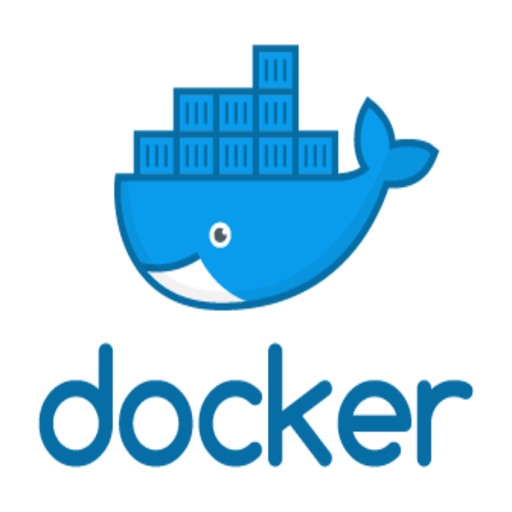

# Fun-With-Docker 
This is the beginning of learning Docker and K8s. 

**Docker** is a tool which is used to automate the deployments of an application in lightweight containers so that application can work efficiently in different environments 

The **Biggest difference** between Containers and Virtual Machines is that the container are quiet different as they all shares one kernel and the virtual machines have a seperate kernel running in each and the containers don't use the principle of virtualization its just using a kernel for different operating os.


### Features:
 - Multiple containers can run on the same hardware
 - high productivity as it uses the same kernel as of the os 
 - maintains isolated applications so that thier dependencies do clash with each other
 - Ouick and easily configurable virtual machines
 

## Installation of Docker in Linux :

To install docker in Linux type the following set of commands

```shell 
sudo apt-get install docker docker.io
```

## Objectives :

- Getting Started With Docker and Kubernetes 
- Learning Concepts 
- Learning Commands
- Fun Excercises

## Author :

Priyansh Gupta
